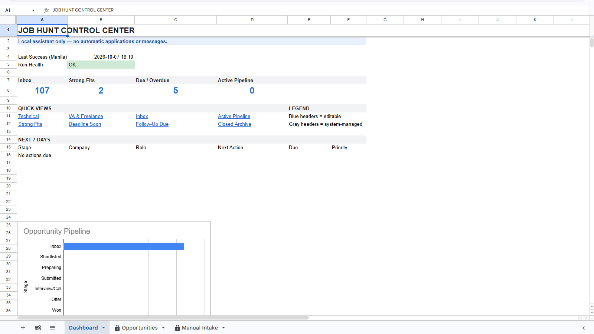
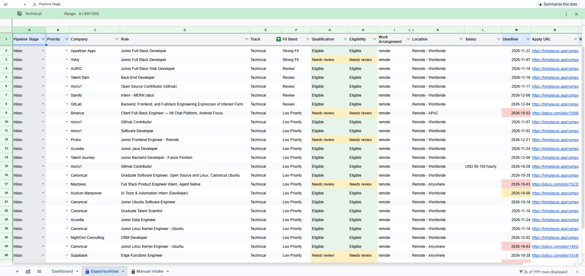

# Job Hunt Automation

[](https://github.com/SAIKO0000/jobhunt-automation/actions/workflows/ci.yml)
[](https://www.python.org/)
[](LICENSE)

A zero-platform-cost, local Windows opportunity-intelligence pipeline. It collects only
approved public job feeds, applies transparent eligibility and fit rules, and updates a
user-owned Google Sheets workbook. Applications and messages always remain manual.



_Actual private-workbook capture from October 7, 2026, after the 18:10 Manila run. Browser,
account, workbook-link, and personal workflow information are outside the frame. These live
queue totals are not the September 3 sample reported below._

## Why this exists

Job searching creates two different problems: finding relevant listings repeatedly and
keeping enough context to act on them. This project automates the repetitive discovery and
organization work without scraping restricted platforms, sending messages, or turning an
AI model into an unsupervised applicant.

The result is intentionally local-first:

- Windows Task Scheduler starts one daily run.
- A typed Python pipeline validates sources, normalizes records, deduplicates listings,
  applies location/cost/seniority gates, and calculates an explainable score.
- Google Sheets provides a familiar review queue through desktop OAuth.
- Local snapshots, leases, and pending-run files support conflict-safe recovery.
- Optional Gemini/Ollama analysis is disabled by default and has no paid fallback.



_Actual Technical view captured October 7, 2026. The first two Himalayas listings returned
exact-job details on the capture date; the image is not a guarantee that every pictured link
is still live. Other rows may need review or have since expired. Public listings retain source
links in the workbook; private notes, contacts, and application outcomes are not shown._

## Architecture

<picture>
  <source media="(max-width: 760px)" srcset="docs/assets/architecture-mobile.svg">
  
</picture>

Task Scheduler provides only the time trigger. The Python package owns policy, validation,
scoring, provider gates, workbook conflict detection, and recovery. n8n was deliberately
excluded because it would introduce another server, credential store, and upgrade surface
while leaving most of the domain logic as custom code.

Read the [short case study](docs/CASE_STUDY.md) or the deeper
[architecture notes](docs/ARCHITECTURE.md).

## Demonstrated result

A scheduled run on September 3, 2026 processed 119 records from two approved sources:

| Outcome | Records |
|---|---:|
| Actionable | 15 |
| Needs manual review | 3 |
| Excluded | 101 |
| Quarantined | 0 |

This is a September 3 operational sample, not the October 7 screenshot state or evidence of
applications, interviews, or hiring outcomes. As checked October 8, 2026, the suite has
198 passing tests and 84.50% statement coverage.

## Safety boundary

The application cannot apply, submit proposals, email, message, control a browser, or
authenticate to job platforms. A workbook status records what the human did; it never
triggers an external action.

Other fail-closed defaults include:

- Himalayas and Jobicy are the only enabled public sources. Restricted platforms use
  user-seeded `Manual Intake` rows.
- Explicit senior-through-executive roles, applicant payments, unpaid work, and requirements
  above the configured three-year search cap are excluded from the daily queue.
- Uncertain seniority, location, or qualification evidence is sent to manual review.
- Five profile claims are owner-verified. AI providers are still disabled by default.
- A live run still requires the `--live` switch and an enabled, owner-approved manifest.
- Scheduled live writes recheck existing Inbox links conservatively. Himalayas uses its
  public exact-job tool; Jobicy uses source URL status. Rows are archived, never deleted,
  only after source expiry or confirmed unavailability.

See [source and outreach compliance](docs/COMPLIANCE.md) for the complete policy boundary.

## Local development

Requirements: Windows, Python 3.12, and a local virtual environment.

```powershell
python -m venv .venv
.venv\Scripts\Activate.ps1
python -m pip install -e ".[dev,sheets,gemini]"
jobhunt validate-config
jobhunt run --dry-run --fixture-dir tests/fixtures
pytest
```

Installation does not authenticate an account, create a workbook, enable AI, or register a
scheduled task. Google setup uses a user-owned project without billing and a Desktop OAuth
client limited to the Sheets scope.

Useful commands:

```text
jobhunt run --dry-run --fixture-dir tests/fixtures
jobhunt run --write --backend local --fixture-dir tests/fixtures
jobhunt auth-google --client-secrets <desktop-oauth.json>
jobhunt credentials status
jobhunt bootstrap-workbook --backend google --spreadsheet-id <id>
jobhunt validate-workbook --backend google --spreadsheet-id <id>
jobhunt replay-pending --backend google --spreadsheet-id <id> --run-id <uuid>
```

For LinkedIn, JobStreet, Indeed, PhilJobNet, OnlineJobs.ph, Wellfound, or Upwork, manually
select a listing and enter only its minimal facts in `Manual Intake`. The system does not
scrape those platforms or use their authenticated sessions.

## Documentation

- [Case study](docs/CASE_STUDY.md)
- [Architecture](docs/ARCHITECTURE.md)
- [Workbook guide](docs/WORKBOOK.md)
- [Operations](docs/OPERATIONS.md)
- [Compliance](docs/COMPLIANCE.md)
- [Cost and setup checklist](docs/COSTS_AND_SETUP.md)
- [Deployment and OAuth setup](docs/DEPLOYMENT.md)

## Cost and limitations

The design has a $0 platform-charge target. Python, Windows Task Scheduler, the approved
public feeds, a no-billing Sheets API project, and local storage have no platform fee.
Electricity, internet, disk space, and human review time still exist.

Coverage is intentionally limited: only two live sources are enabled, deterministic rules
can produce false positives or negatives, Google Sheets is not tamper-evident, the computer
must be available for scheduled runs, and the project does not claim that automation improves
hiring outcomes.

Released under the [MIT License](LICENSE).
