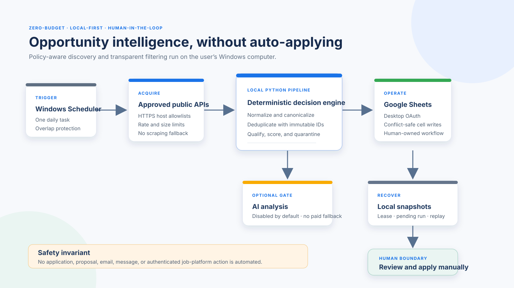

# Local architecture



```text
Windows Task Scheduler
  -> local Python CLI
  -> approved public feeds
  -> deterministic normalization, dedupe, qualification/cost/location gates, and scoring
  -> optional Gemini Free -> narrowly gated local Ollama fallback
  -> user-owned Google Sheet through desktop OAuth
  -> local snapshots, pending commits, quota state, and sanitized logs
```

Task Scheduler supplies only time-based orchestration. The typed Python package owns the
source policy, validation, scoring, provider gates, conflict detection, and recovery. This
keeps the runtime small and avoids a second server, credential store, and update surface.

n8n is intentionally not used. For this project it would still need a continuously managed
local server, its own credential store and upgrades, while most policy/scoring/recovery work
would remain custom code. Task Scheduler plus the existing tested Python package provides the
needed daily trigger with fewer moving parts and no additional platform cost. The checked-in
schedule runs at 07:17 local time so the daily-refresh Himalayas feed is not over-polled.

All external features are deny-by-default. Sheets credentials are passed explicitly to the
workbook gateway. The runtime never loads ambient cloud credentials. Source failures remain
partial failures and cannot activate a scraper or alternate source.

Before a mutating run, the system snapshots the workbook locally. It persists processed
output in `runtime/pending/<run-id>.json` before attempting a commit. A failed or ambiguous
Sheets write is reconciled by run ID and can be replayed with the normal UUID and human-edit
conflict checks.

The visible queue is intentionally not the raw acquisition table. Definite exclusions are
stored in a hidden protected table and remain in the dedupe index; uncertain but relevant
records are visible as manual review; actionable records enter the normal queue. Manual-only
platforms enter through user-seeded workbook rows and never through browser automation.
